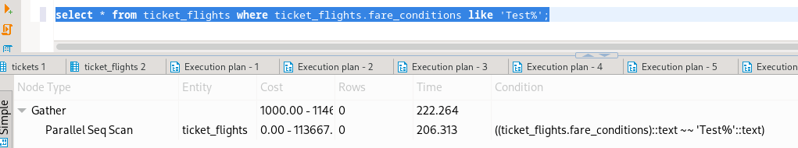

# Homework 3

## 3.2.1 Index Failures 01 


### Postgres
```sql
create index ticket_flights_fare_cond_idx on ticket_flights(fare_conditions);
```



  - Với query Like ở đầu sẽ không sử dụng Index vì Index này sử dụng cấu trúc dữ liệu là B-Tree
  - B-Tree sẽ hoạt động trên các câu truy vấn trong khoảng `=, >, >=, <, <=, BETWEEN`  
  - Với câu query LIKE  'prefix%' thì Postgres chỉ support index dựa trên 'C' collate hoặc index sử dụng `text_pattern_ops operator`     
```sql
create index ticket_flights_fare_cond_idx on ticket_flights(fare_conditions text_pattern_ops);
```

- Khi Tạo index với `xxx_pattern_ops` thì index sẽ không hoạt động được các truy vấn `=, >, >=, <, <=`

### Mysql


### Oracle


`Với Mysql/Oracle thì vẫn hỗ trợ index với query LIKE 'prefix%'`

## 3.2.2. Index Failures 02


- Trường hợp query: `cond1(filed có index) OR cond2(field không có index)` thì kết quả sẽ là hợp của cond1 và cond2 mà cond2 phải duyệt toàn bộ bảng vì không có index nên câu truy vấn sẽ phải duyệt toàn bộ bảng và không hoạt động được index

## 3.2.3 Index Failures 03


- Trường hợp này database sẽ convert 1 lần flight_id sang int và tindexhực hiện tìm kiếm trên index nên sẽ hoạt động được trên index

- Database báo lỗi syntax

## 3.2.4 Index Failure 04


- Mặc định database sẽ không hỗ trợ index thông qua function vì key index tree chỉ được tạo dựa trên value của field

## 3.2.5 Index Failure 05


- Với các cấu truy vấn trên, database sẽ hiểu nó là các biểu thức toán học nên sẽ không sử dụng được index

