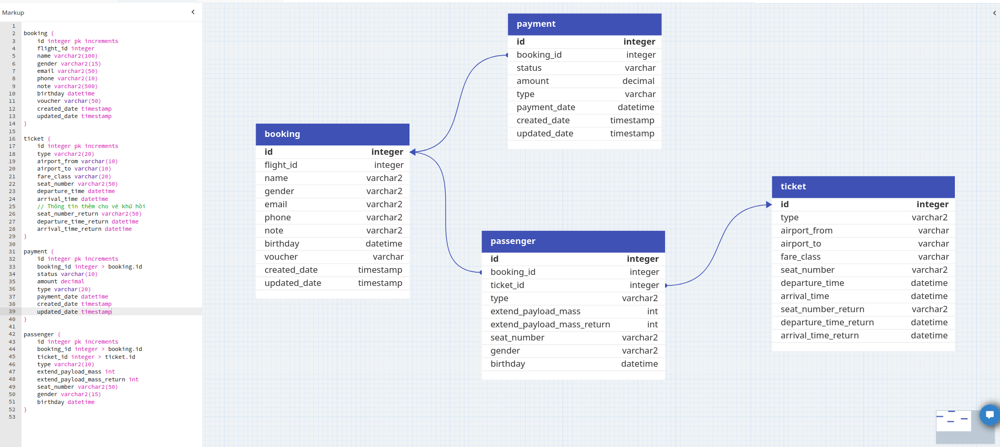

# Homework 07
## Requirements
Design schema Booking flights
- Use proper table format
- Use views

## Design
### Schema


### View
- View để lấy toàn bộ thông tin ticket theo một booking
```sql
CREATE VIEW booking_ticket AS
SELECT b.id, t.* FROM ticket t 
JOIN passenger p ON t.id = p.ticket_id
JOIN booking b ON b.id = p.booking_id
```

- View để lấy toàn bộ thông tin hành khách theo một booking
```sql
CREATE VIEW booking_passengers AS
SELECT b.id, p.* FROM passenger p
JOIN booking b ON b.id = p.booking_id
```