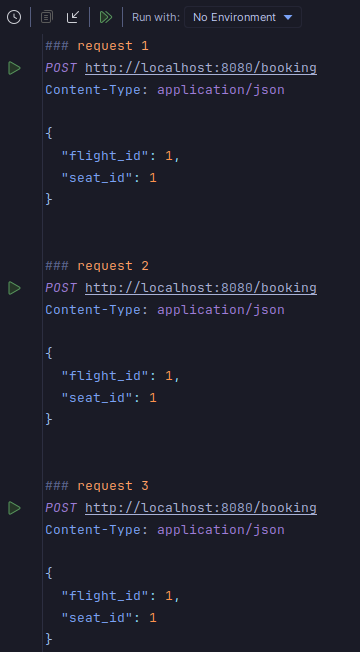
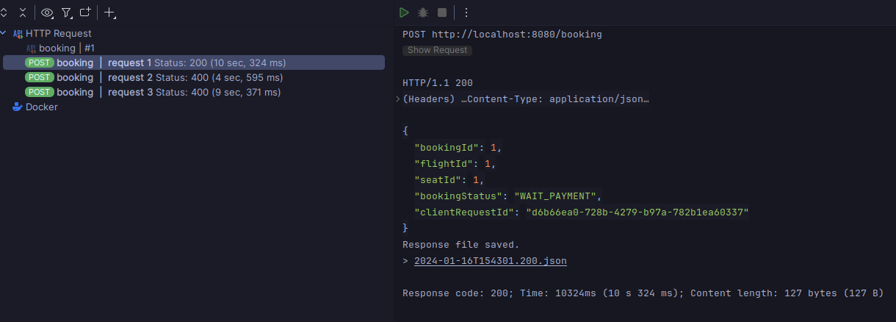
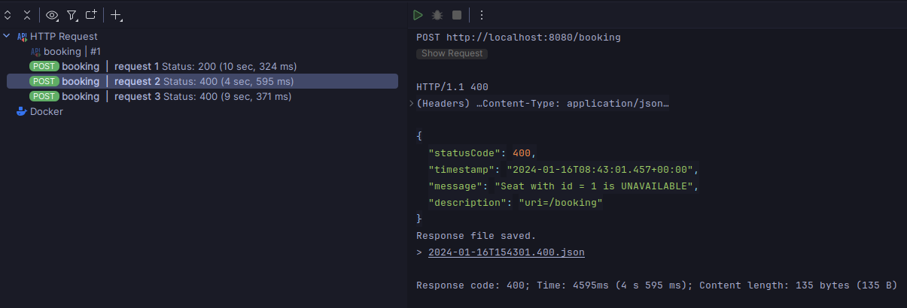
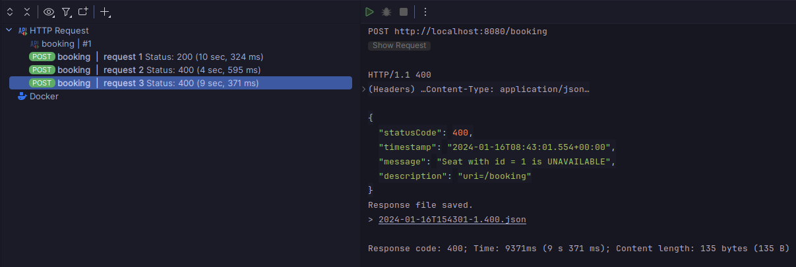
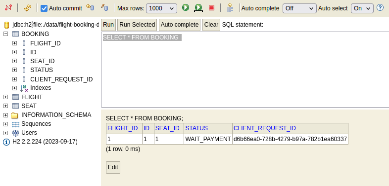
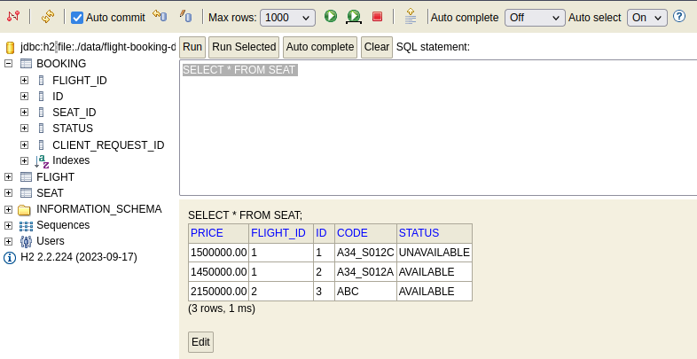

# Homework 10
## Homework: Implement Distributed Lock
- 2 requests booking the same seat (A34_S012C) on a flight (FA634)
- No need to implement DB and booking logic

## Demo 
### Booking
- Request [booking.http](booking.http)

### Booking success

